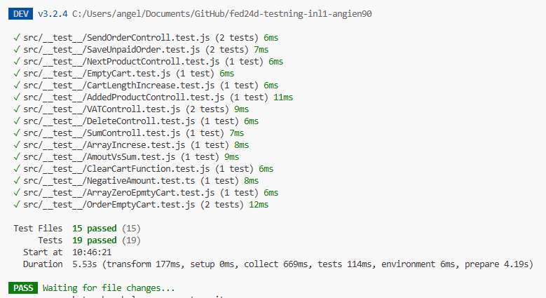
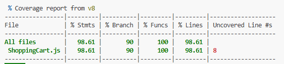

# Inlämning 1 i kursen Testning - Enhetstester, mocking & automatisering

Uppgiften examinerar följande moment från kursplanen:

* Testautomatisering med enhetstester och integrationstester
* Hur man använder mockning i tester
* Genomföra enhetstester och integrationstester för att upptäcka och åtgärda buggar

## Uppgiftsbeskrivning
Skapa en klass som hanterar en "varukorg", typ ShoppingCart. I varukorgen ska det gå att:

* Lägga till en produkt
* Öka/minska produktens antal om den redan finns i varukorgen
* Ta bort en produkt
* Kunna lägga till flera olika typer av produkt, och att rätt produkt minskar/ökar i antal.
* Om rabattkoden "418_I'm_A_Teapot" anges så ska totalpriset minska med 25%.

#### Skapa också:

* Testdata för en varukorg/produkter (mocking)

#### Du ska också implementera att:

* Testerna körs i samband med att du pushar till git eller/(och) att de körs i samband med en pull request till main-branchen (och du då pushar till dev)

## Bedömning
#### För G
* Du har skrivit en exempelklass/kod som implementerar varukorgens funktionalitet.
* För G ska din "code coverage" vara på 60% av "applikationskoden".
* Testerna körs på GitHub när en push skett till main, eller din huvudbranch.
* Du har i README:n lämnat in en skärmdump på din "code coverage"-rapport.

#### För VG
Utöver kraven för G:

* För VG ska din "code coverage" vara på minst 80% av "applikationskoden".
* Du har infört automatisering av att testerna körs vid commit/push (dvs. det går inte att pusha kod om inte testerna går igenom).
* Du ska ha skrivit en README som beskriver vilka tester som har implementerats samt skärmdumpa resultaten.

#### Bonus, för din egen skull
I din README kan du inkludera en badge för om testerna har gått igenom. 

# Uppgiftsanteckningar

## Lista över tester i applikationen 

* Verifiera att varukorgen är tom från början
* Testa att om det läggs till en produkt, så ökar length på cart-variabeln.
* Verifiera/testa att den tillagda produkten har rätt namn/pris/beskrivning/produkt-ID.
* Verifiera/testa att nästa tillagda produkt har rätt namn/pris/beskrivning/produkt-ID.
* Verifiera att längden på arrayen minskar när en produkt tas bort helt.
* Verifiera att antal produkter som finns i varukorgen motsvarar summan av alla tillagda produkter. T.ex. om du har 3 st av produkt A och 4 st av produkt B, då ska summan av antalet produkter i varukorgen vara 3 + 4 = 7.
* Verifiera att längden på arrayen är 0 om alla produkter är borttagna.
* Verifiera att totalen (summan) av alla produkter uppdateras korrekt när produkter läggs till/tas bort.
* Verifiera att momssatsen är korrekt när produkternas antal uppdateras (t.ex. 25% för varor, 12% för livsmedel och 6% för kultur (tidningar, böcker, musik, teater)).
* Verifiera att clearCart-funktionen nollställer produktlistan, totalbeloppet och momsbeloppet.
* Verifiera att rätt produkt tas bort, t.ex. att det verkligen är produkten med ID 1.
* Hantera negativa produktantal i varukorgen (t.ex. -1 produkt). Exempel: Säkerställ att produkten tas bort om värdet är 0 eller lägre.
* Verifiera att en order inte kan placeras om inte all kundinformation är korrekt ifylld (jämför med en vanlig webbshop vad som behöver fyllas i).
* Verifiera att det inte går att beställa en tom varukorg.
* Bonus: Verifiera att när sidan laddas om så behålls föregående beställning i varukorgen om den inte är "betald". T.ex. via localStorage.

### Code coverage

### Vitest

Badge som visar om tester passerar

## Automatisering

## Installation av projektet  
#### Initierar projektet och vitest
1. npm init
2. npm install -D vitest
3. npm create vitest@latest . 
(Valde Vue och Javascript i detta projekt)
4. npm add -D vitest
5. Anpassade package.json (lade till test: vitest under script)

Testfiler ligger i mappen __test__ och för att köra testet kör man npm run test.

#### Initierar routing på sidan
npm install vue-router

#### Initierar Code coverage
1. Skapade filen vitest.config.js
2. Lade till coverage: vitest --coverage i package.json
3. npm install --save-dev @vitest/coverage-v8
4. npm run coverage

#### Kör projektet
1. npm install
2. npm run dev